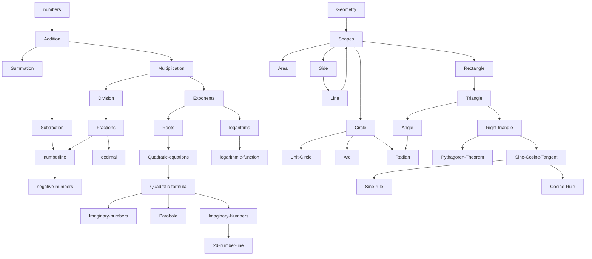

# mathematics-roadmap
A roadmap of mathematics all the way from highschool math to advanced programming related math.

```mermaid
graph TD;
numbers-->Addition
Addition-->Summation
 Addition--> Subtraction-->numberline
  Addition-->Multiplication-->Division-->Fractions
Fractions-->decimal
Fractions-->numberline
numberline-->negative-numbers
Multiplication-->Exponents-->Roots-->Quadratic-equations-->Quadratic-formula-->Imaginary-numbers
Quadratic-formula--> Parabola
Exponents-->logarithms-->logarithmic-function
Quadratic-formula-->Imaginary-Numbers
Imaginary-Numbers-->2d-number-line

Geometry-->Shapes
Shapes-->Circle
Circle-->Unit-Circle
Circle-->Arc
Circle-->Radian
Angle-->Radian
Shapes-->Rectangle-->Triangle
Triangle-->Right-triangle-->Pythagoren-Theorem
Right-triangle -->Sine-Cosine-Tangent-->Sine-rule
Sine-Cosine-Tangent --> Cosine-Rule
Triangle-->Angle
Shapes-->Area
Shapes-->Side
Side-->Line
Line-->Shapes

```
